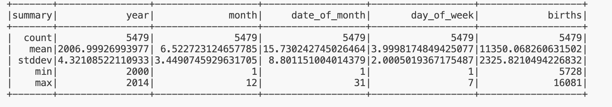
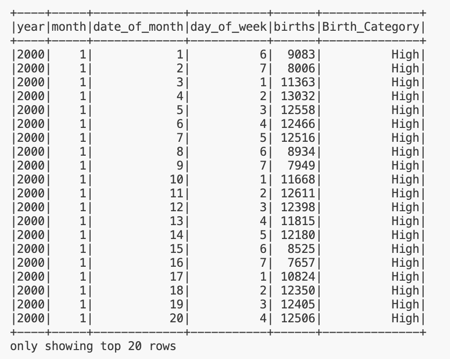

## DEmini10: PySpark Data Processing
The project involves utilizing PySpark for data processing on a substantial dataset. The main objectives are to incorporate a Spark SQL query and execute a data transformation. I use fivethirtyeight's dataset on showhost guests to peform these operatons. 

### Prep and Run:
1. open codespaces
2. wait for environment to be installed
3. run: `python main.py`
4. [Pyspark Output Data/Summary Markdown File](pyspark_output.md)
5. Spark Jobs: https://curly-waddle-jj4q54v6j5r6cj6jx-4040.app.github.dev/jobs/ 

### Format code
1. Format code: `make format`
2. Lint code: `make lint`
3. Test code: `make test`

### Process
Extract the dataset via `extract` , then start a spark session via `start_spark` , load the dataset via `load_data` . Next we can query the dataset via `query`,do some more transformation on the sample dataset via `example_transform`, and finally end my spark session via `end_spark`. 

## References
1. https://github.com/nogibjj/python-ruff-template
2. https://raw.githubusercontent.com/fivethirtyeight/data/master/births/US_births_2000-2014_SSA.csv

